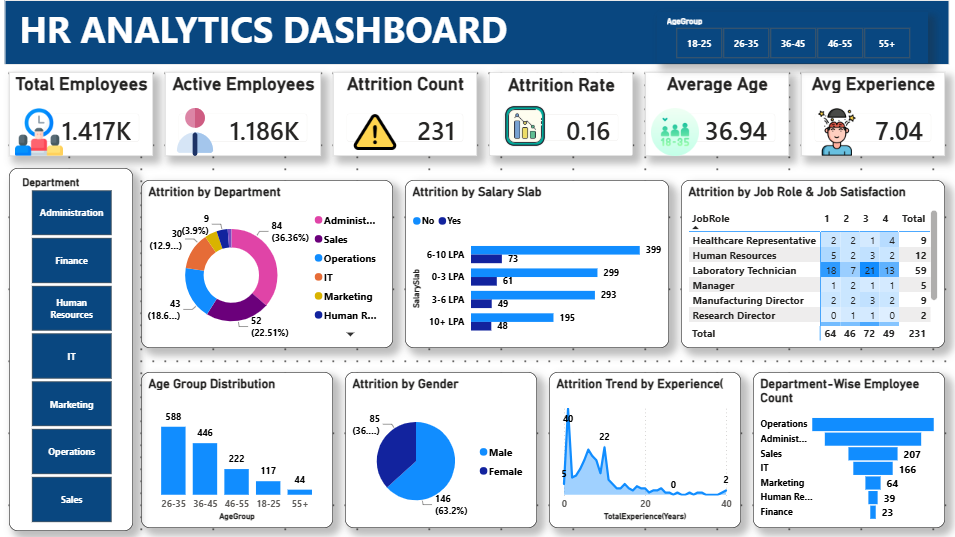

# HR Attrition Analysis — Power BI Dashboard



## Project Overview

The **HR Attrition Analysis Dashboard** is an interactive Microsoft Power BI project designed to analyze employee attrition and understand workforce patterns across departments, job roles, compensation levels, job satisfaction, gender, and experience.

The goal is to transform employee-level HR data into a clear decision-support dashboard that helps HR stakeholders identify attrition patterns and areas that may require further investigation.

> **Important:** The dashboard identifies patterns and associations in the dataset. These relationships should not automatically be interpreted as causal relationships.

---

## Business Problem

Employee attrition can affect workforce stability, hiring needs, productivity, and retention planning.

This project uses HR analytics to answer questions such as:

- How large is the current workforce?
- How many employees have left the organization?
- What is the overall attrition rate?
- Which departments show higher attrition?
- Which job roles show higher attrition?
- How does attrition vary across salary slabs?
- How does job satisfaction relate to attrition?
- How does employee experience relate to attrition?
- Are there specific employee segments that deserve closer retention analysis?

---

## Key KPIs

| KPI | Purpose |
|---|---|
| **Total Employees** | Size of the workforce represented in the dataset |
| **Attrition Count** | Number of employees who have left |
| **Attrition Rate** | Percentage of employees who have left |
| **Average Experience** | Average total professional experience represented in the dataset |

These KPIs are supported by the underlying HR dataset and Power BI dashboard.

---

## Business Questions

### Workforce & Attrition

- What is the overall attrition rate?
- How many employees have left the organization?
- Which departments contribute more to attrition?
- Which job roles show higher attrition?

### Compensation

- How does attrition vary across salary slabs?
- Are lower or higher compensation groups associated with different attrition patterns?

### Employee Satisfaction

- How does job satisfaction vary across employee groups?
- Which job roles show stronger or weaker attrition patterns at different satisfaction levels?

### Experience

- How does attrition change across employee experience levels?
- Are less-experienced or more-experienced employees represented differently among attrition cases?

### Workforce Segmentation

- How does attrition vary by gender?
- Which employee segments should HR investigate more closely for retention planning?

---

## Dashboard Analysis

### 1. Workforce KPIs

The dashboard provides a quick overview of:

- Total Employees
- Attrition Count
- Attrition Rate
- Average Experience

### 2. Attrition by Department

Compares attrition across departments to identify areas with relatively higher employee exits.

### 3. Attrition by Gender

Examines attrition patterns across gender groups.

### 4. Attrition by Job Role & Job Satisfaction

Combines job role and job satisfaction to explore how retention patterns differ across roles and satisfaction levels.

### 5. Attrition by Salary Slab

Analyzes employee attrition across compensation bands.

### 6. Attrition by Experience

Explores how attrition patterns vary across levels of total professional experience.

---

## Key HR Insights

The dashboard is designed to help HR stakeholders:

- Identify departments and roles with higher attrition
- Explore employee segments that may need further investigation
- Examine the relationship between job satisfaction and attrition
- Compare attrition across compensation levels
- Understand how experience is associated with employee retention
- Support workforce monitoring and retention planning

The dashboard should be used as a starting point for deeper HR investigation rather than as proof of the cause of employee attrition.

---

## Tools & Technologies

- **Microsoft Power BI**
- **Power Query**
- **DAX**
- **Data Modeling**
- **Data Cleaning**
- **Data Visualization**
- **Interactive Filters / Slicers**
- **KPI Cards**
- **Bar Charts**
- **Donut Charts**
- **Area Charts**
- **Matrix / Heatmap-style analysis**

---

## Data Model

The Power BI report uses an HR analytics dataset containing fields such as:

- `EmpID`
- `Age`
- `AgeGroup`
- `Attrition`
- `Attrition Count`
- `Attrition Rate%`
- `Department`
- `Gender`
- `JobRole`
- `JobSatisfaction`
- `SalarySlab`
- `TotalExperience(Years)`
- `YearsatCompany`

These fields support the dashboard's KPIs, segmentation, calculations, filters, and visual analysis.

---

## Analysis Workflow

```text
HR Employee Data
       ↓
Data Preparation
       ↓
Data Modeling
       ↓
DAX Calculations
       ↓
KPI Development
       ↓
Interactive Dashboard
       ↓
Attrition Analysis
       ↓
HR Insights
       ↓
Business Investigation
```

---

## Dashboard Preview

The main dashboard preview is available below:


The editable Power BI report is available at:

```text
powerbi/HR_Analytics_Dashboard.pbix
```

The source dataset is available at:

```text
data/HR_Analytics-4.csv
```

---

## Repository Structure

```text
HR-Attrition-Analysis/
│
├── README.md
│
├── data/
│   └── HR_Analytics-4.csv
│
├── powerbi/
│   └── HR_Analytics_Dashboard.pbix
│
└── screenshots/
    └── HR_Analytics_Dashboard.png
```

---

## How to Use the Project

### 1. Clone the repository

```bash
git clone https://github.com/yatijaiswal435-collab/HR-Attrition-Analysis.git
```

### 2. Open the Power BI report

Open:

```text
powerbi/HR_Analytics_Dashboard.pbix
```

using Microsoft Power BI Desktop.

### 3. Review the dashboard

Use the dashboard's filters and visual interactions to explore:

- Attrition
- Departments
- Job roles
- Salary slabs
- Job satisfaction
- Experience
- Gender

---

## Business Value

This project demonstrates how HR data can be transformed into a decision-support dashboard:

**Workforce Monitoring → Attrition Analysis → Segment Identification → Deeper Investigation → Retention Planning**

The dashboard can support HR teams in identifying where attrition is concentrated and which employee groups deserve additional investigation.

---

## Learning Outcomes

This project strengthened my practical skills in:

- Power BI dashboard development
- Power Query
- DAX calculations
- Data modeling
- KPI development
- Interactive visualization
- HR analytics
- Business question framing
- Data-driven storytelling
- Business-oriented analysis

---

## Project Skills Demonstrated

**Power BI • DAX • Power Query • Data Modeling • Data Cleaning • Data Visualization • HR Analytics • Business Analysis • KPI Development • Dashboard Design**

---

## Limitations

- The dataset represents the employee population included in the source data.
- The dashboard identifies patterns and associations but does not establish causation.
- The dataset does not provide every factor that could influence employee attrition.
- Further HR, employee-feedback, compensation, performance, and organizational data could be used for deeper investigation.

---

## Conclusion

This project demonstrates how Power BI can turn employee-level HR data into an interactive analytical dashboard.

The analysis moves from:

**Workforce Data → KPI Monitoring → Attrition Segmentation → Pattern Identification → HR Investigation**

rather than treating attrition as a single overall percentage.

---

## Author

**Yati Jaiswal**

Aspiring Data Analyst | Python | SQL | Excel | Power BI

GitHub: https://github.com/yatijaiswal435-collab
